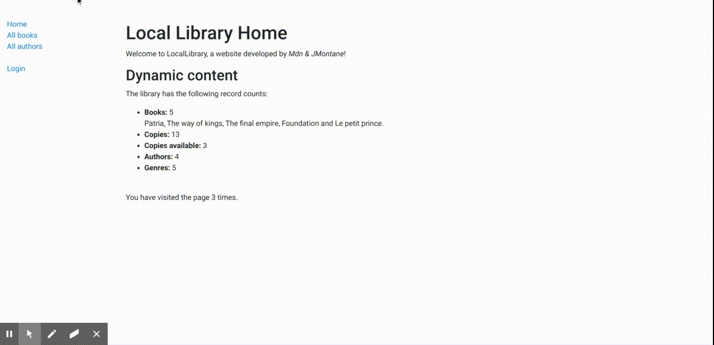

# Local Library
> A django-based online catalog for a small local library.             

## Live
You can take a look clicking [here](https://mdn-django-locallibrary.herokuapp.com/catalog/).

## Overview

This web application creates an online catalog for a small local library, where users can browse available books and manage their accounts.

The main features that have currently been implemented are:

* There are models for books, book copies, genre, language and authors.
* Users can view list and detail information for books and authors.
* Admin users can create and manage models. The admin has been optimised (the basic registration is present in admin.py, but commented out).
* Librarians can renew reserved books

## Technologies

For this project, I used **Django**, following Mdn step by step fundamentals.       
It has been deployed on [Heroku](https://www.heroku.com/).

## Motivation

Before doing more ambitious projects and learn new things, I wanted to go back to the fundamentals, and study them as much as I could.                
_I was following Mozilla Developer Network Tutorial [MDN Django Web Framework](https://developer.mozilla.org/en-US/docs/Learn/Server-side/Django)._

## Meta
                  
JMontane – [jmontane.dev](https://www.jmontane.dev)

Github profile [jaumemy](https://github.com/jaumemy/)

Source code repo [Mdn](https://github.com/mdn/django-locallibrary-tutorial)
